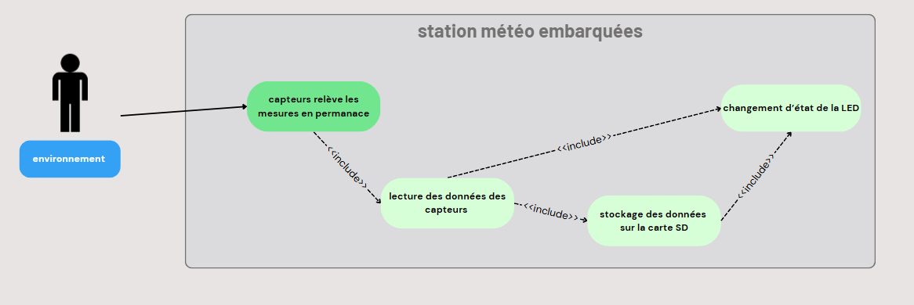
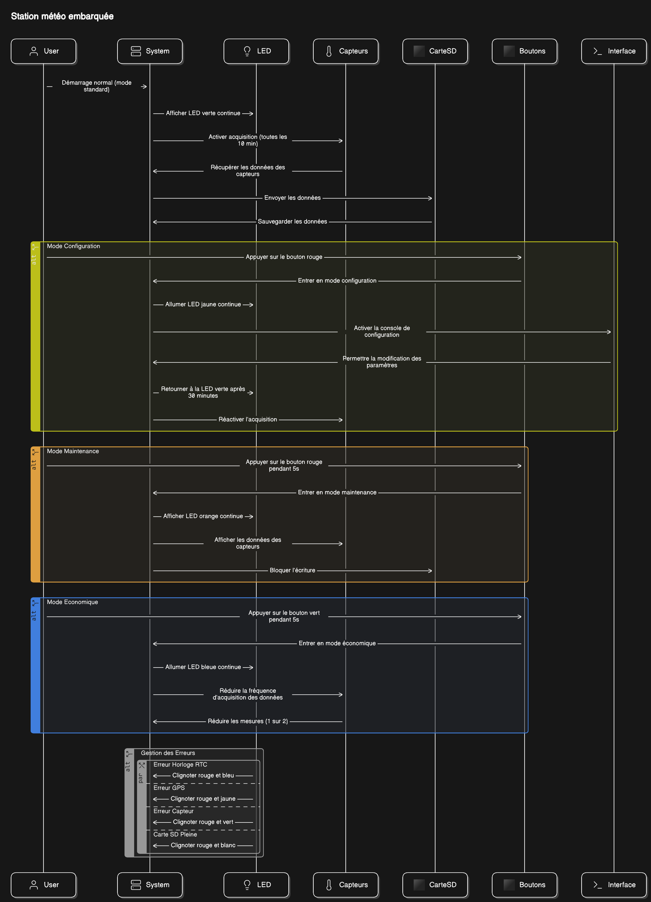
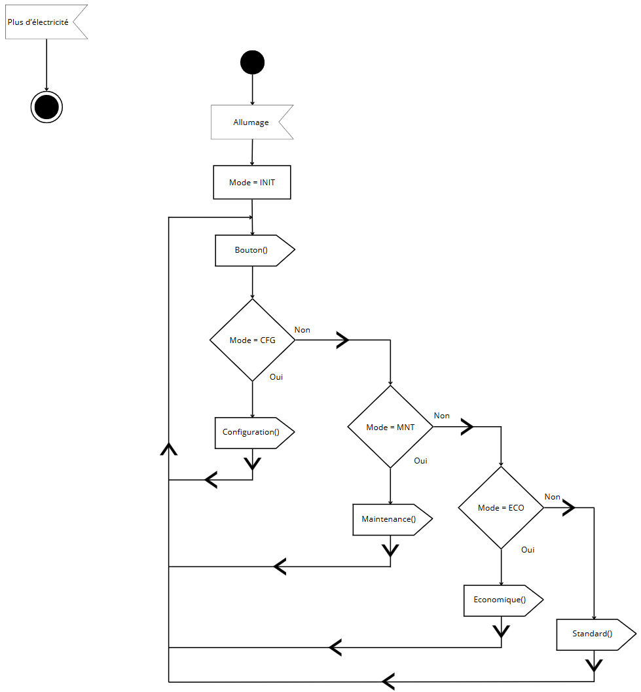
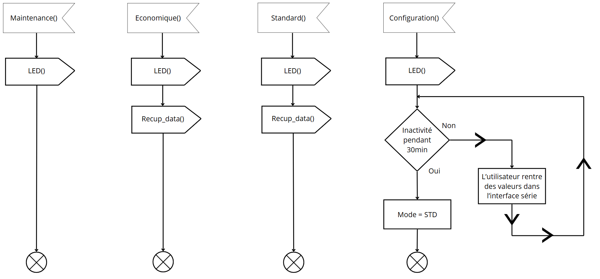
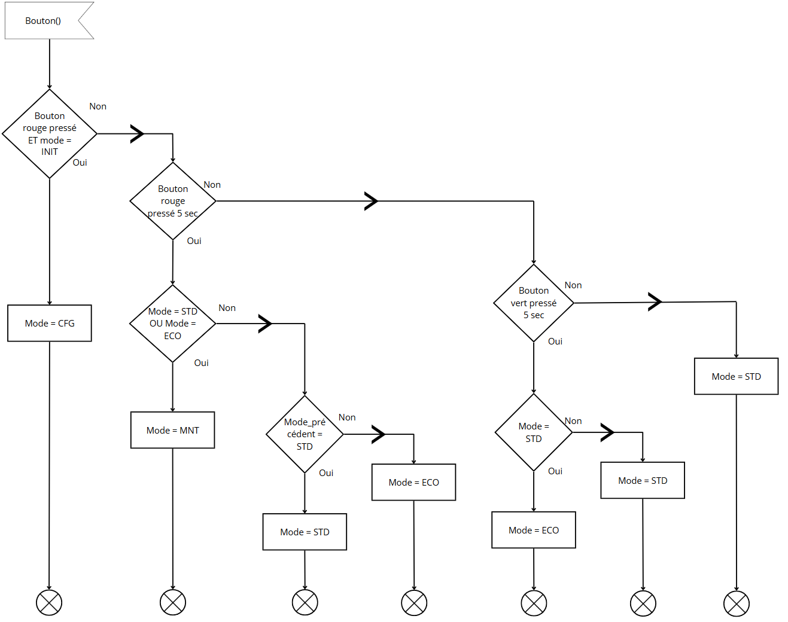
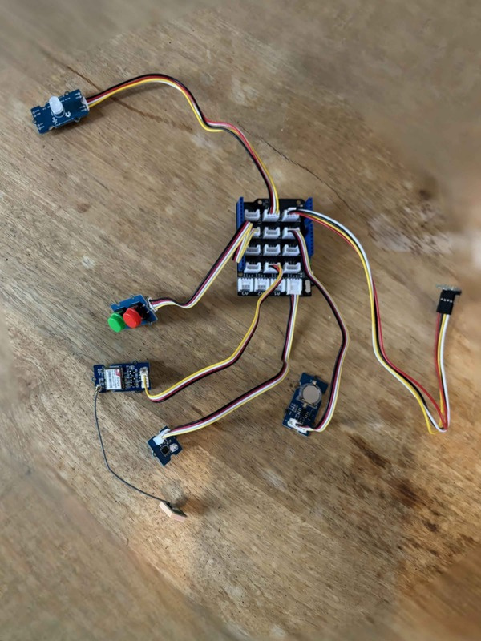
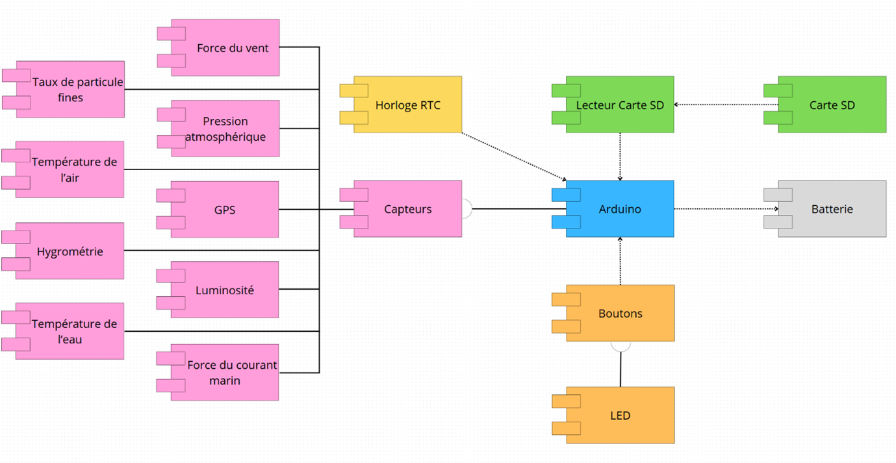

# 🌦️ Embedded Systems: Worldwide Weather Watcher

**🇬🇧 English** | 🇫🇷 [Français](README.fr.md)

Project carried out at **CESI** during my second year of integrated preparatory school (2024-2025), as part of the *Embedded Systems* module.
This repository contains the **complete board program** (Deliverable 3 – Prototype): the Arduino firmware of an embedded weather station prototype meant to equip ships, which takes environmental readings, timestamps them and logs them to an SD card.

> Project already submitted as part of the course. **The code is kept exactly as it was delivered in November 2024**, French comments and all. No bug has been fixed since: the gaps between the specification and the actual behaviour are documented in detail in *Known limitations*, rather than quietly repaired.

> **Note on language:** the code, the comments and the serial console messages are in French, as they were written at the time. Only this README is available in English.

---

## 🎬 Scenario: the AIVM and the surveillance ships

The **International Agency for Meteorological Vigilance (AIVM)** launches an ambitious programme: deploying surveillance ships across the oceans, fitted with embedded weather stations tasked with measuring the parameters that drive the formation of cyclones and other natural disasters. In the long run, these ships will exchange their data to anticipate extreme events.

Many shipping companies have agreed to equip their vessels. In return, the stations have to be **simple, rugged and operable by any crew member** — not by an engineer. One of the agency's directors entrusts the prototype to the startup **THS**, where our team works.

**The problem:** how do you build, on an 8-bit microcontroller with 32 KB of program memory, a system that continuously acquires six physical quantities, timestamps them, archives them, reports its own failures without a screen, and lets itself be reconfigured by a sailor armed with nothing but a serial terminal?

---

## 🧭 Design

The system was modelled in UML before a single line of code was written (Deliverable 1 – System analysis, September 2024). The diagrams below are the ones from the original submission.

> ⚠️ These diagrams describe the system **as it was specified**. The program that was ultimately delivered departs from them on several points — intervals, error colour codes, real-time display in maintenance mode. The gaps are listed under *Known limitations*.

### Use case

The environment is the system's true actor: the sensors take readings continuously, the data is read, stored on the SD card, and any incident translates into a change of LED state.



*(The two other use cases — system startup and mode selection by the crew — are in [`pictures/`](pictures/).)*

### Sequence diagram

An overview of the four modes and of error handling, from startup through to the diagnostic blink patterns.



---

## 🛠️ How it works

### The five states of the system

The program is a state machine driven by a global `mode` variable. The main loop (`loop()`) does nothing but dispatch to the current mode's function; it is the **hardware interrupts** of the two buttons that change the state.



| Mode | LED | How to enter it | What it does |
|---|---|---|---|
| **`INIT`** | off | at startup | A window of a few seconds during which the red button gives access to configuration. Then switches to `STD` automatically. |
| **`STD`** *(standard)* | 🟢 solid green | by default at the end of `INIT` | Nominal cycle: read all sensors, timestamp, write one line to the SD card, then wait. |
| **`ECO`** *(economy)* | 🔵 solid blue | **green** button ≥ 5 s | Same as `STD` but the interval between two acquisitions is **doubled**, to save battery. |
| **`CFG`** *(configuration)* | 🟡 solid yellow | **red** button during `INIT` | Opens a console on the serial port: the user types commands to change thresholds and intervals, stored in EEPROM. Exits on inactivity and returns to `STD`. |
| **`MNT`** *(maintenance)* | 🟠 solid orange | **red** button ≥ 5 s from `STD` or `ECO` | Suspends all writing to the SD card, so that the card can be **removed without risk of corruption**. A second long press returns to the previous mode. |

Each mode boils down to a handful of calls. Maintenance only lights the LED — it is precisely the fact of **not** calling `Recup_data()` that guarantees no write takes place and that the SD card can be pulled out.



### The two buttons

The buttons are wired as `INPUT_PULLUP` and read by **hardware interrupt** on changing edges (`attachInterrupt(..., CHANGE)`). On each edge the program records `millis()`, then, on release, computes the press duration: this is how a short press is told apart from a long one without ever blocking the main loop.

| Button | Pin | Short press | Long press (≥ 5 s) |
|---|---|---|---|
| 🔴 **Red** | D3 (`INT1`) | `INIT` → `CFG` | `STD`/`ECO` ↔ `MNT` |
| 🟢 **Green** | D2 (`INT0`) | — | `STD` ↔ `ECO` |



> ℹ️ **A deliberate departure from the brief.** The specification had the red button both *entering* maintenance and *leaving* economy mode. The program could not tell the two intentions apart using the same button and the same duration. The team therefore reassigned the exit from economy mode to the green button. This choice is justified in Deliverable 1.

### LED colour codes

The station has **no screen**. The chainable RGB LED is the only diagnostic channel on deck: a solid colour indicates the mode, an **alternation of two colours** signals a fault. As long as an error is present, it takes priority over the mode colour.

| Signal | Meaning |
|---|---|
| 🟢 solid green | Standard mode, all good |
| 🔵 solid blue | Economy mode |
| 🟡 solid yellow | Configuration mode |
| 🟠 solid orange | Maintenance mode |
| 🔴 ↔ 🔵 | RTC clock access error |
| 🔴 ↔ 🟡 | GPS access error |
| 🔴 ↔ 🟡 | Sensor access error — the same pattern as the GPS error, see *Known limitations* |
| 🔴 ↔ ⚪ | SD card access error (missing, unreadable or full) |
| 🔴 ↔ ⚪ *(slower rate)* | SD card write error |

The `led()` function tests the errors in a cascade, from the most to the least critical, before falling back on the current mode's colour.


### The measured quantities

| Quantity | Component | Interface | Pin |
|---|---|---|---|
| Air temperature | BME280 | I²C (`0x76`) | A4 / A5 |
| Atmospheric pressure | BME280 | I²C (`0x76`) | A4 / A5 |
| Humidity | BME280 | I²C (`0x76`) | A4 / A5 |
| Light level | Photoresistor | Analog | A0 |
| Position | GPS module | Software UART, 9600 baud | D8 / D9 |
| Date and time | DS3231 | I²C | A4 / A5 |

The `Recup_data()` function first checks that each peripheral is present — every failure fills in the `error` variable used by the LED — then reads the sensors, writes the line to the SD card and applies the wait, doubled in economy mode.


### The data file

Each cycle appends one line to the `data.csv` file at the root of the SD card. The headers are written once, when the file is created.

```csv
Date;Heure;Temp;Press;Hum;Lum;Lat;Long
11/4/2024; 23:9:0; 21.53C;1013.42 hPa;48.20%;62.75%;43°28'52.4"N; 5°23'11.0"E;
```

The semicolon is used as the separator so that the file opens straight into Excel with French regional settings.

### Configuration mode

Once in `CFG`, the station waits for commands on the serial port at **9600 baud**, in `PARAMETER=value` form, one per line. Each command is acknowledged by an echo.

| Command | Purpose | Default |
|---|---|---|
| `LOG_INTERVALL=` | Interval between two acquisitions | `1000` |
| `TIMEOUT=` | Inactivity delay before leaving `CFG` mode | `30` |
| `LUMIN=` | Enables (1) or disables (0) the light sensor | `1` |
| `LUMIN_LOW=` / `LUMIN_HIGH=` | Low / high light thresholds | `255` / `768` |
| `TEMP_AIR=` | Enables (1) or disables (0) the temperature sensor | `1` |
| `MIN_TEMP_AIR=` / `MAX_TEMP_AIR=` | Air temperature thresholds (°C) | `-10` / `60` |
| `HYGR=` | Enables (1) or disables (0) humidity | `1` |
| `HYGR_MINT=` / `HYGR_MAXT=` | Temperature range over which humidity is valid (°C) | `0` / `50` |
| `PRESSURE=` | Enables (1) or disables (0) the pressure sensor | `1` |
| `PRESSURE_MIN=` / `PRESSURE_MAX=` | Pressure thresholds (hPa) | `850` / `1080` |
| `RESET` | Restores every default value | — |

> ⚠️ These commands are **accepted and written to EEPROM, but they have no effect whatsoever on the station's behaviour**. See *Known limitations* — this is the project's main unfinished feature.

---

## 🔌 Hardware and wiring

The station — christened **NomadWeather** in the team's user manual — is a three-board stack: an **Arduino Uno** (AVR ATmega328P) at the bottom, an **SD card shield** above it, and a **Grove Base Shield** on top, the whole thing clipped into a transparent holder. Every peripheral then plugs into the Grove shield with a keyed four-wire cable, which makes the build entirely solder-free.

Power comes over USB, from a power bank or from a computer.

### What's in the box

| # | Item | | # | Item |
|---|---|---|---|---|
| 1 | Grove connector shield | | 7 | RTC clock |
| 2 | SD card | | 8 | RGB LED |
| 3 | Arduino SD card shield | | 9 | Pressure, humidity and temperature sensor |
| 4 | Arduino board | | 10 | Push buttons |
| 5 | Arduino board holder | | 11 | GPS |
| 6 | Light sensor | | | |

### The prototype



The photo above is the actual prototype used for the Deliverable 3 demonstration, shown unstacked from the Arduino board.

### Wiring


Six peripherals, six Grove connectors. A Grove digital connector carries **two consecutive pins**, which is why the firmware declares them in pairs: plugging the buttons into `D2` yields D2 *and* D3, the LED into `D5` yields D5 *and* D6, the GPS into `D8` yields D8 *and* D9.

| Peripheral | Grove connector | Pins used by the firmware | Interface |
|---|---|---|---|
| Push buttons (green + red) | `D2` | D2 (green), D3 (red) | Digital, `INT0` / `INT1` interrupts |
| Chainable RGB LED | `D5` | D5 (data), D6 (clock) | 2-wire |
| GPS module | `D8` | D8 (RX), D9 (TX) | Software UART |
| Light sensor | `A0` | A0 | Analog |
| BME280 | `I²C` | A4 (SDA), A5 (SCL) | I²C |
| DS3231 RTC clock | `I²C` | A4 (SDA), A5 (SCL) | I²C |
| SD card reader | — *(own shield)* | D4 (CS), D11–D13 | SPI |

The SD card reader is the one peripheral that is not a Grove module: it sits on its own shield and takes over the hardware SPI bus, with D4 as chip select.

> ⚠️ The two shields stack by press-fit onto header pins that bend easily, and the six modules have to go into exactly the right connectors. The user manual devotes nine illustrated steps and two separate warnings to this.

### Component architecture

The component diagram from Deliverable 1 shows the dependencies between the elements: the Arduino board sits at the centre, everything depends on it, and it in turn depends only on the battery.



The brief planned for four third-party modules to be integrated later — water temperature, sea current strength, wind strength, fine particle levels. They appear in pink on the left of the diagram: **they were not implemented**, for lack of memory on the board.

---

## 🚀 Installation and setup

> **Requirements:** [`arduino-cli`](https://arduino.github.io/arduino-cli/) or the Arduino IDE 2.x. If you already have the IDE, there is nothing else to install: `arduino-cli` ships inside it, under `resources\app\lib\backend\resources\`.

### 1. Clone the repository

```bash
git clone https://github.com/Estebge/Systeme-embarque.git
cd Systeme-embarque
```

### 2. Install the dependencies

```bash
arduino-cli core install arduino:avr
arduino-cli lib install "Adafruit BME280 Library" "RTClib" "Grove - Chainable RGB LED" "SD"
```

`Adafruit BusIO` and `Adafruit Unified Sensor` are pulled in automatically as dependencies. `EEPROM`, `Wire`, `SPI` and `SoftwareSerial` ship with the AVR core.

### 3. Compile

```bash
arduino-cli compile --fqbn arduino:avr:uno StationMeteo
```

### 4. Upload and observe

```bash
arduino-cli board list                                        # find the port, e.g. COM3
arduino-cli upload -p COM3 --fqbn arduino:avr:uno StationMeteo
arduino-cli monitor -p COM3 -c baudrate=9600
```

The serial monitor at **9600 baud** is the only way to talk to the station: it prints the state of the SD card (`Carte OK`, `Fichier créé`, `Écriture des données`), the GPS sentences received, and it is where the configuration mode commands are typed.

From the Arduino IDE the path is the same: open `StationMeteo/StationMeteo.ino`, then *Sketch → Verify*, *Sketch → Upload*, *Tools → Serial Monitor*.

---

## 🧪 Testing without the hardware

Might as well say it plainly: **without the components wired up, this station cannot be run.** The program queries the BME280, the DS3231 and the SD reader on its very first cycle; without them it raises errors and blinks the LED, measuring and recording nothing.

What remains possible with no hardware at all:

| What you can do | What it proves |
|---|---|
| **Compile** (steps 1 to 3 above) | That the dependencies resolve and that the firmware fits in the Uno's memory |
| **Read the size report** produced by the compilation | The real memory footprint — see the next section |
| **Read the code and this documentation** | How the state machine works, without having to run it |

With a bare Arduino Uno and no sensors, it is also possible to upload the firmware and watch the startup sequence and the detection errors for the missing peripherals on the serial monitor. That is useful to check an upload toolchain, not to validate the station.

> ℹ️ **No sample `data.csv` is included.** The recordings stayed on the station's SD card and were never copied before the hardware went back. The format of the file is documented above, but there is no genuine capture to show.

---

## 💾 Memory footprint

This is **the** structural constraint of the project, and the direct cause of most of the limitations listed below. The Uno's ATmega328P has 32 KB of program memory and 2 KB of RAM.

| Board | Program memory | Static RAM | Remaining headroom |
|---|---|---|---|
| **Arduino Uno** *(the project's target)* | 30,312 / 32,256 B → **93 %** ⚠️ | 1,513 / 2,048 B → **73 %** | **535 B** for the stack *and* the heap |
| Arduino Mega 2560 | 31,956 / 253,952 B → 12 % ✅ | 1,525 / 8,192 B → 18 % | 6,667 B |

*(Figures taken at compile time; program memory usage varies by a few dozen bytes depending on library versions.)*

On the Uno there were therefore **about 2 KB of program memory** left to implement everything that was missing. The 535 free bytes of RAM are all the more critical given that the program manipulates `String` objects, which allocate dynamically: this is the textbook configuration in which an Uno becomes unstable.

---

## 📦 Dependencies

| Library | Validated version | Role |
|---|---|---|
| `Adafruit BME280 Library` | 2.3.0 | Temperature, pressure and humidity |
| `Adafruit BusIO` | 1.17.1 | I²C/SPI abstraction layer *(dependency)* |
| `Adafruit Unified Sensor` | 1.1.15 | Common sensor interface *(dependency)* |
| `RTClib` | 2.1.4 | DS3231 real-time clock |
| `Grove - Chainable RGB LED` | 1.0.0 | Chainable RGB LED |
| `SD` | 1.3.0 | FAT file system on the SD card |
| `EEPROM`, `Wire`, `SPI`, `SoftwareSerial` | — | Ship with the `arduino:avr` core |

---

## ⚠️ Known limitations

This section is deliberately detailed. The project was submitted and graded in this state; what follows honestly describes the gap between what was asked for and what the program actually does.

### The root cause: memory, and pointers

The brief called for a persistent configuration system: the user sets thresholds from the console, those values are written to EEPROM, read back at startup, and the program relies on them to raise alerts and pace its acquisitions.

**Half of that chain was never wired up.** Writing to EEPROM works; reading back, storing into the data structures and using them in the business logic were never finished. The reason is twofold, and the team owns it:

- **The team did not sufficiently master pointers and passing parameters by reference** in the time available. Handling nested structures, passing them to functions without copying them and filling them from EEPROM demanded a fluency we had not yet acquired. It was the first semester in which we tackled these notions, and they were still to be consolidated by the end of the module.
- **There was almost no room left.** At 93 % of program memory used, the budget available to add that layer was about 2 KB. Every attempt ran into the size of the binary.

The result is a set of features that are present on the surface — the commands exist, they respond, they write — but have no real effect.

### Gaps between the specification and the delivered program

| Expected feature | Actual state |
|---|---|
| Configuration read back from EEPROM and applied | ❌ **Not implemented.** Neither `EEPROM.read()` nor `EEPROM.get()` appears anywhere in the program: the configuration is write-only. |
| Min/max thresholds raising an alert | ❌ **Not implemented.** The out-of-range check is present but commented out, and the corresponding error is never raised. An intermediate version of the file carried the comment "*Ne fonctionne pas, compliqué*" ("Doesn't work, complicated"). |
| Enabling/disabling individual sensors | ❌ **Not implemented.** Every sensor is read systematically, whatever the configured flags say. |
| Decoding GPS sentences (real latitude/longitude) | ❌ **Not implemented.** The program checks that it receives NMEA sentences and prints them, but does not decode them. **The coordinates written to the CSV are constants**, hard-coded (those of the campus). The decoding code is present as a comment: it could never be tested for lack of satellite reception indoors, and it relies on an array of 15 `String` objects that would not fit in the 535 available bytes of RAM. |
| 10-minute acquisition interval in standard mode | ⚠️ **Non-conforming value.** The real interval is 1 s in `STD` and 2 s in `ECO`, development values that were left in place. The doubling in economy mode does work, but on those values. |
| Economy mode: one GPS acquisition out of two, alternating sensors | ⚠️ **Partial.** Only the doubling of the interval is implemented; no sensor alternation. |
| Maintenance mode: real-time display of the readings | ⚠️ **Partial.** Suspending writes to the SD card — the mode's main purpose, which is what allows the card to be removed safely — works. The real-time display of the readings does not. |
| 30-minute inactivity timeout in configuration mode | ⚠️ **Non-conforming and defective.** The coded timeout is 30 seconds, and it is measured from board startup rather than from the last command received: past 30 s of uptime, configuration mode closes immediately. The `TIMEOUT` parameter is never consulted. |
| Rotation of archive files | ❌ **Not implemented.** A single `data.csv` file grows indefinitely, with no size limit and no archiving by date. |
| Third-party modules (water, current, wind, particles) | ❌ **Not implemented**, for lack of memory. |

### Defects in the delivered code

Found while re-reading the code for this publication. **They have deliberately not been fixed**, so that the repository reflects the actual submission.

| Defect | Consequence |
|---|---|
| `rtc.adjust(...)` is called on **every cycle**, outside the `if (rtc.lostPower())` test that precedes it | The clock is permanently reset to the compilation time: **the CSV timestamps never advance**. |
| The acquisition delay uses the EEPROM **address** (`ADDR_LOG_INTERVAL`, which is 0) instead of the stored value | The `LOG_INTERVALL=` command has no effect; the program always falls back on the default value. |
| The EEPROM addresses are spaced one byte apart, whereas `EEPROM.put()` writes **two** for an `int` | The parameters overlap and overwrite one another in cascade. No stored value is reliable. |
| `DEFAULT_LOG_INTERVAL` is 1000 but is stored in a `uint8_t` | Silent overflow: the value becomes 232. |
| Variables shared between the interrupts and the main loop are not declared `volatile` | The compiler may cache them; reads of `long` variables are not atomic. |
| No debouncing on the buttons | A mechanical bounce fires several interrupts and desynchronises the state machine. |
| `bme.begin()`, `SD.begin()` and `rtc.begin()` are called on every iteration | These initialisation operations are replayed in a loop, which is costly and makes SD card access unstable. |
| `led()` is called **before** `Recup_data()` in each mode | The LED always shows the error state of the previous cycle. |
| The `error` variable is overwritten by each successive test | Only the last error encountered survives; the others are masked. |
| The GPS error is raised as soon as the serial buffer is empty | But a GPS only emits one burst per second: the error is nearly always a false positive. The 64-byte `SoftwareSerial` buffer also overflows during the `delay()` calls. |
| Six `delay(100)` calls are interleaved in the middle of the CSV write | 600 ms of blocking per record, to no purpose. |
| The sensor error colour code is red ↔ yellow | The specification called for red ↔ green; it is therefore indistinguishable from the GPS error. |
| Maintenance mode never calls `Recup_data()` | The `error` variable stays frozen: the LED keeps showing an old error instead of the mode's orange. |
| Units are glued to the values in the CSV (`21.53C`, `1013.42 hPa`) | The file opens in Excel but the columns are not directly usable as numbers. The date is in US format, without zero padding. |

---

## 📁 Repository layout

```
Systeme-embarque/
├── README.md                  ← English
├── README.fr.md               ← French
├── StationMeteo/
│   └── StationMeteo.ino       ← the complete firmware
└── pictures/
    ├── montage.jpg            ← photo of the prototype
    ├── cablage.svg            ← wiring diagram
    ├── uml-cas-utilisation-1..3.png
    ├── uml-sequence.png
    ├── uml-activite-boucle-principale.png
    ├── uml-activite-boutons.png
    ├── uml-activite-modes.png
    ├── uml-activite-recup-data.png
    ├── uml-activite-led.png
    └── uml-composants.png
```

The UML diagrams come from **Deliverable 1 – System analysis** (September 2024) and are labelled in French. The photo comes from the Deliverable 3 presentation. The wiring diagram, also labelled in French, was reconstructed from the pin assignments declared in the firmware.

> The file was originally called `LED.ino`, after the very first experiment of the project. Arduino requires a sketch to carry the name of its parent folder, so it was moved into `StationMeteo/` so that the repository compiles straight after a clone. **Not a single line of the file's contents was changed.**

---

## 👥 Authors

Project carried out at **CESI** (2024-2025) by:

- **Estéban** : https://github.com/Estebge
- **Trystan** : https://github.com/trystanbouzonrueda
- **Maxime** : https://github.com/haguetm
- **Yanis** : https://github.com/yyyanis
- **Rayene** : https://github.com/rayene00
